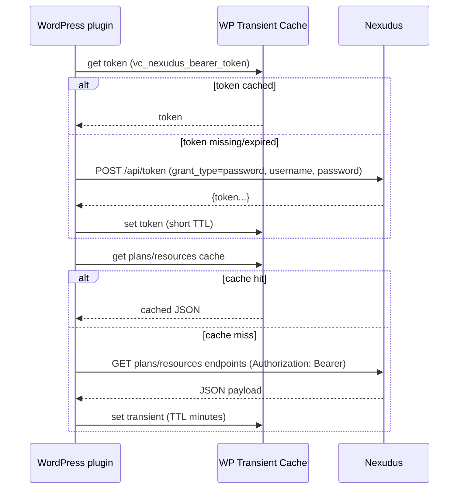

# Building a WordPress Plugin to Integrate Nexudus for The Toledo Tech Loft

## Executive summary

A WordPress plugin that **retrieves membership plans and bookable room/space options from Nexudus** can be built reliably by combining (a) a **server-side Nexudus API client** inside WordPress, (b) **short-lived caching** for performance and API-throttling compliance, and (c) **webhook-driven cache invalidation** for near real-time freshness. Nexudus exposes multiple API “surfaces” (a “REST API” for admin/inventory data, a “Public API” used by the member portal, and a “Marketplace API” focused on availability/booking flows), with many endpoints documented as requiring **OAuth2 Bearer tokens** and **role-based permissions** (e.g., `Resource-List`, `Booking-List`). citeturn24search2turn28search5turn1search6

For authentication, the most concretely documented (and easiest to operationalize) method for a private, single-organization integration is to obtain a **Bearer token** by calling `POST /api/token` with a password-style grant (`grant_type:password`, `username`, `password`). Nexudus documentation notes that if the user has enabled 2FA, a TOTP code is additionally required for token issuance. citeturn16search4turn15view0 In practice, this drives a key design choice: either (1) use a **dedicated Nexudus “service” user** intended for backend integrations (and configure it in a way that allows headless token issuance), or (2) adopt a Nexudus **marketplace/published add-on** credential model (App Key + App Secret) if your goal is distributable/published integration—though the publicly accessible snippet-level documentation is less detailed on the full flow for that approach. citeturn34search0turn16search4

Nexudus publishes explicit **API throttling limits** (e.g., GET burst throttling and daily caps for writes), which makes caching and webhook invalidation especially important for a WordPress site that could receive many anonymous pageviews. citeturn0search1 Nexudus also provides a first-class webhooks feature (Admin Panel path: `Settings > Integrations > Webhooks`), with event types including **Plans**, **Bookings**, **Contracts**, **Space**, and more—ideal for keeping site-rendered plan/resource lists up to date without aggressive polling. citeturn23view0

Finally, The Toledo Tech Loft’s Nexudus tenant configuration (subdomain, plan IDs, resource IDs, visibility rules) is **not publicly discoverable from the sources reviewed**, so implementing and validating the integration requires **admin access** to their Nexudus dashboard and inventory configuration. citeturn32search0turn7search5turn31search2turn24search10

## Evidence from the two GitHub repositories

The `zabuuq/vc-nexudus` repository currently contains only a minimal README stating the intent (“WordPress plugin for accessing Nexudus API”), with no implementation code visible in the retrieved listing. fileciteturn28file0L1-L1

The `zabuuq/virtualcorners.com-wp` repository includes an existing WordPress plugin directory `vc-blocks/`, with a plugin entrypoint file `vc-blocks/vc-blocks.php`. This indicates an established pattern in your codebase for packaging WordPress functionality as a plugin (even though this one is for Gutenberg blocks, not external API integration). fileciteturn22file0L1-L1

The `virtualcorners.com-wp` repository README describes the repo as an execution environment for an approved WordPress site build (not an integration repository), which supports the assumption that Nexudus integration work should live in the dedicated `vc-nexudus` plugin repo rather than in the site build repo. fileciteturn20file1L1-L1

## Nexudus authentication and credential setup for a WordPress plugin

### What Nexudus appears to support (from accessible primary docs)

Nexudus documentation repeatedly labels many API endpoints as using **OAuth2** with a **Bearer token** credential. Examples include Resource and Booking endpoints, each listing required roles such as `Resource-List` or `Booking-List`. citeturn24search2turn28search5

A central token issuance endpoint is documented as:

- `POST https://spaces.nexudus.com/api/token` — “Gets a Bearer token based on a username and password,” and if the user has 2FA enabled, a TOTP code is also required. citeturn16search4  
- A Nexudus help article shows a concrete example request pattern using `grant_type:password`, `username`, and `password` for `POST /api/token`. citeturn15view0

Nexudus also documents a token issuance endpoint for **impersonating a user for the Public API**:

- `POST https://spaces.nexudus.com/api/sys/users/{user_id}/token/refresh` — “GET a token to impersonate a user when accessing the Public API.” citeturn16search0

Additionally, Nexudus’ developer docs mention a simpler “Basic Authentication” approach for non-published, internal-only applications, but the accessible page fragment is limited to the high-level guidance (not the full mechanics). citeturn11view0

Nexudus’ help content also documents SSO options for portal/app sign-in such as entity["company","Okta","identity management company"] and entity["company","Auth0","identity platform"] for member/admin login flows, but these are conceptually separate from server-to-server API access for a WordPress plugin. citeturn0search4turn9search10

### Recommended authentication method for this plugin

Given the available documentation, the most practical approach for a private WordPress plugin (not a published marketplace add-on) is:

**Use a Bearer token and request it server-side via `POST /api/token` (password-style grant), with a dedicated Nexudus “service” user that has minimal roles required for read-only inventory access.** citeturn16search4turn15view0turn24search2turn28search5

This recommendation is driven by:

- The token endpoint is documented and used in Nexudus’ own integration examples. citeturn15view0turn16search4  
- Most needed endpoints are explicitly “OAuth2 / Bearer token” protected and list required roles. citeturn24search2turn28search5turn17search0  
- WordPress has mature primitives for safe server-side HTTP calls (`wp_remote_get`, `wp_remote_post`) and caching (Transients API). citeturn40search0turn39search1

#### Required “scopes” (interpreted as Nexudus roles) and least-privilege set

Nexudus documentation uses a role/permission naming convention of `<Object>-<Action>` (e.g., `Resource-Read`, `Booking-List`). For this plugin’s read path, a minimal role set typically includes:

- `Resource-List` and/or `Resource-Read` (for space/room inventory) citeturn24search2turn24search0  
- `Booking-List` and/or booking-related permissions if you query bookings for availability windows (or if you create bookings) citeturn28search5turn28search1  
- `Tariff-*` (for membership plans / “Price Plans”) citeturn17search0  
- Any additional object roles required by endpoints you choose (e.g., Product read if you surface add-ons or booking-associated products). citeturn30search2turn30search0

Because Nexudus exposes multiple API families (Public API vs REST API vs Marketplace API), the exact role requirements can vary by endpoint. When Nexudus includes “Required roles” in endpoint docs, treat that as authoritative. citeturn24search2turn1search6turn16search6

#### Token lifecycle and refresh flow

The accessible Nexudus docs clearly show how to *obtain* a bearer token, but they do not clearly expose (in the crawled fragments) the complete token response schema (e.g., explicit `expires_in`, `refresh_token`). citeturn16search4turn15view0

A robust plugin strategy that does **not** require assumptions about “refresh tokens” is:

- Cache the bearer token in WordPress (transient or option) for a short TTL.
- On 401/403 responses, re-authenticate via `POST /api/token` and retry once.
- Treat tokens as opaque; do not assume JWT structure unless you confirm via real responses in your tenant. citeturn16search4turn39search1turn40search0

This strategy is aligned with WordPress transient guidance: expiration is a maximum, and you must be resilient to premature cache eviction. citeturn39search1

### Comparison table of auth approaches for a WordPress plugin

| Auth approach | How it maps to Nexudus docs | Strengths | Weaknesses / risks | Best fit |
|---|---|---|---|---|
| **Bearer token via `POST /api/token` (password grant pattern)** | Nexudus documents `POST /api/token` with username/password (and possibly TOTP for 2FA). citeturn16search4turn15view0 | Straightforward; consistent with “OAuth2 / Bearer token” requirements on many endpoints; easy to implement with `wp_remote_post`. citeturn40search0turn24search2 | Requires securely storing a Nexudus username/password in WordPress; headless use is complicated if 2FA is enforced (needs TOTP). citeturn16search4 | Private, single-site integration; service-user model |
| **Basic Authentication per request** | Nexudus suggests “simpler way” for internal apps. citeturn11view0 | No token cache required; conceptually simple | Sends long-lived credentials on every request; harder to rotate; generally weaker security posture than bearer tokens | Only if Nexudus tenant discourages token issuance but allows basic auth (must confirm) |
| **“Published add-on” App Key + App Secret** | Nexudus docs state published add-ons require App Key + App Secret. citeturn34search0 | Avoids storing a staff password; likely better for distributable integrations | Full flow details not present in the accessible snippet; may require marketplace registration processes | Intended for marketplace-style distribution |
| **Impersonation token for Public API** (`/api/sys/users/{user_id}/token/refresh`) | Explicitly documented for obtaining a token to access the Public API on behalf of a user. citeturn16search0 | Useful when you want to call member-portal endpoints “as the user” | Requires private/admin capability to mint user tokens; not ideal for anonymous public website reads | Mixed admin+member experiences (e.g., logged-in website area) |

### Security best practices for storing Nexudus secrets in WordPress

A WordPress plugin should implement settings storage with the **Settings API** and restrict access to privileged admins (`manage_options`). citeturn39search0turn39search3

For secrets (passwords, tokens, webhook shared secret):

- Store secrets in the database only if necessary; prefer storing an **encryption key outside the DB** (e.g., in `wp-config.php`) and encrypting secret option values at rest.
- Ensure settings updates are capability-checked; WordPress explicitly advises capability checks for option updates. citeturn39search4turn39search0
- Use WordPress HTTP API (`wp_remote_get`, `wp_remote_post`) and consider `wp_safe_remote_request` when you accept arbitrary URLs (SSRF defense). citeturn40search0turn40search3
- Use the Transients API (or an object cache) for caching API responses and tokens, with careful fallback behavior. citeturn39search1

## Nexudus setup requirements for The Toledo Tech Loft

### Do they need to set up an API token or credentials in Nexudus?

Based on accessible Nexudus documentation, API access is commonly enabled at the **user level** (“API access” checkbox) and then authenticated via token issuance using that user’s credentials. citeturn7search5turn16search4turn15view0

The “API token” concept appears in Nexudus docs in other contexts (e.g., third-party access control providers), but that is distinct from authenticating *to Nexudus* itself. citeturn16search12

So, for this WordPress plugin, The Toledo Tech Loft should plan to configure:

- A **dedicated Nexudus user account** intended for the integration, with minimal required roles.
- **API access enabled** for that user.
- A secure credential storage/rotation procedure on the WordPress side. citeturn7search5turn16search4turn39search0

### Step-by-step: enabling Nexudus API access for a user (as documented)

A Nexudus legacy documentation page describes the steps to enable API access for users:

1. In the Nexudus admin side menu, click **Settings**. citeturn7search5  
2. Click **Users and security**. citeturn7search5  
3. Click the **user** you want to grant API access to. citeturn7search5  
4. In the **Access** section, select the **API access** checkbox. citeturn7search5  
5. Click **Save changes**. citeturn7search5  

Because this is labeled “legacy” and “last updated 6 years ago,” you should treat it as directionally valid but verify the exact menu names in the current Nexudus dashboard UI. citeturn7search5

### Additional Nexudus admin access needed for this project

If The Toledo Tech Loft-specific Nexudus settings are not public (which appears to be the case from the public web crawl), you will need admin access to:

- Identify the workspace’s `{defaultBusinessWebAddress}.spaces.nexudus.com` base URL used by many Public API endpoints. citeturn17search1turn24search7  
- Confirm which Plans are published and which Resources are visible/bookable.
- Retrieve Plan IDs and Resource IDs (useful for debugging, mapping, and validation rules). Nexudus provides UI guidance for finding Plan IDs (`Inventory > Plans`, URL contains `tariffs/…`) and Resource IDs (`Inventory > Resources`, URL contains `resources/…`). citeturn17search10turn24search10  

## Nexudus API endpoints for memberships, rooms, availability, pricing, and bookings

### Rate limits and “listings may be partial” semantics

Nexudus publishes API throttling limits (GET burst throttling and write limits) that should shape plugin caching and batching behavior. citeturn0search1

Nexudus endpoint docs also warn that “listing” endpoints (search/list) may omit properties for performance; you should fetch full records with “GET one” / “GET multiple” before acting on the data (especially for updates). This warning is stated explicitly on multiple “Search …” endpoints. citeturn16search6turn17search2

### Endpoint catalog

The table below lists the most directly relevant endpoints from official Nexudus documentation. URLs are shown as code (per best practice for publishing exact endpoints).

| Domain | Function | Method + endpoint | Key parameters / payload | Auth + roles (when documented) | Notes |
|---|---|---|---|---|---|
| Auth | Obtain bearer token | `POST https://spaces.nexudus.com/api/token` | Form-style fields include `grant_type:password`, `username`, `password`; if 2FA enabled, a TOTP code is required (parameter name not shown in crawled snippet). citeturn15view0turn16search4 | Bearer token issuance | Central auth building block |
| Plans | Published plans (portal/public surface) | `GET https://{defaultBusinessWebAddress}.spaces.nexudus.com/en/profile/tariff?_depth=3` | Query param `_depth=3` controls object graph depth. citeturn17search1 | OAuth2 / Bearer token | Returns “published plans available to the current user” |
| Plans | Plan data model | (schema doc) | Tariff fields include `Name`, `Price`, `Visible`, `Description`, `SignUpFee`, `CurrencyCode`, `GroupName`, etc. citeturn17search0 | Roles: `Tariff-*` citeturn17search0 | Use for field mapping and modeling |
| Member membership details | Contracts + benefits for current customer | `GET https://{defaultBusinessWebAddress}.spaces.nexudus.com/en/allowances/plans?_depth=4` | `_depth=4` citeturn17search6 | OAuth2 / Bearer token | Useful for logged-in experiences |
| Member membership details | Contracts (admin-style inventory) | `GET https://spaces.nexudus.com/api/billing/coworkercontracts` | Search/list parameters not shown in crawled snippet. citeturn20search10 | OAuth2 / Bearer token | Use if you need contract-level detail outside the member portal surface |
| Resources | Resource (room/space) record | `GET https://spaces.nexudus.com/api/spaces/resources/{id}` | `{id}` integer citeturn24search0 | OAuth2 / Bearer token; roles include `Resource-Read` citeturn24search0 | Full resource record |
| Resources | Multiple resources by IDs | `GET https://spaces.nexudus.com/api/spaces/resources/?id=[{id1},{id2},…]` | `id=[…]` list syntax citeturn24search2 | OAuth2 / Bearer token; role `Resource-List` citeturn24search2 | Useful after you’ve discovered IDs via other queries |
| Resources | Resource data model | (schema doc) | Fields include `Name`, `ResourceTypeId`, `Visible`, `RequiresConfirmation`, amenity booleans, etc. citeturn24search3 | Roles: `Resource-*` citeturn24search3 | Use for mapping and modeling |
| Availability/search | Search resources (portal/public surface) | `GET https://{defaultBusinessWebAddress}.spaces.nexudus.com/en/bookings/search` | Parameters not shown in crawled snippet (described as “available at a given date and optionally for a given customer”). citeturn24search7 | (Public API surface) | Often easiest way to find bookable resources in a date context |
| Availability/search | Marketplace search across a location | `GET https://spaces.nexudus.com/api/apps/marketplaceapplications/search` | Params not shown in snippet. citeturn24search11 | OAuth2 / Bearer token | Designed for marketplace-style queries |
| Availability + pricing | Check availability and return price | `GET https://spaces.nexudus.com/api/apps/marketplaceapplications/available` | Query parameters not shown in snippet; returns conflict info + price; documented error codes include `BOOKING_CONFLICT`, `NO_CREDIT`, `INVALID_TARIFF`, etc. citeturn30search1 | OAuth2 / Bearer token | Recommended for “can I book this at this time and what will it cost?” |
| Pricing | Price quote for a booking window | `POST https://{defaultBusinessWebAddress}.spaces.nexudus.com/en/bookings/getBookingPrice` | JSON body includes booking object with `ResourceId`, `ToTime`, and optional products. citeturn30search12 | Public API surface | Provides a documented example request body |
| Booking options | Create booking (marketplace) | `POST https://spaces.nexudus.com/api/apps/marketplaceapplications/book` | Params/payload not shown; shares a standard error-code taxonomy. citeturn30search8 | OAuth2 / Bearer token | Intended flow: availability → quote → book |
| Booking options | Update booking (marketplace) | `PUT https://spaces.nexudus.com/api/apps/marketplaceapplications/book` | Params/payload not shown; error codes documented. citeturn28search2 | OAuth2 / Bearer token | Same error codes as booking/create + availability |
| Booking options | Create booking (admin booking record) | `POST https://spaces.nexudus.com/api/spaces/bookings` | Booking record payload (not shown in snippet). citeturn28search1 | OAuth2 / Bearer token | Works at booking-record level |
| Booking options | Read/search bookings | `GET https://spaces.nexudus.com/api/spaces/bookings` and `GET https://spaces.nexudus.com/api/spaces/bookings/{id}` | Search params not shown. citeturn28search7turn28search6 | OAuth2 / Bearer token | Useful for calendar widgets and admin views |
| Booking options | Booking calendar in date range | `GET https://{defaultBusinessWebAddress}.spaces.nexudus.com/en/bookings/fullCalendarBookings` | Date-range parameters not shown in snippet. citeturn28search10 | Public API surface | Useful for visually rendering availability windows |
| Add-ons | Products available with a resource | `GET https://{defaultBusinessWebAddress}.spaces.nexudus.com/en/bookings/getResourceProducts` | Params not shown. citeturn30search0 | Public API surface | Helps render “booking add-ons” in site UI |

### Pagination and filtering (what can be stated rigorously)

The official Nexudus endpoint pages shown in the crawl do not consistently expose the full list of query parameters in static HTML (many pages rely on interactive “Try It” tooling). Therefore, the exact pagination parameter names for every list endpoint cannot be exhaustively enumerated from the retrieved fragments alone. citeturn28search7turn24search12

However, two operationally important facts are explicitly stated:

- Nexudus has distinct “Search/list” endpoints (e.g., `GET /api/spaces/bookings`, `GET /api/spaces/accesstokens`) and warns that listings may omit some fields; therefore, a plugin should treat list responses as “lightweight” and fetch full entities via “GET one” / “GET multiple” when needed. citeturn16search6turn17search2  
- Nexudus publishes throttling limits that make it prudent to implement pagination and caching conservatively rather than repeatedly scanning large listings. citeturn0search1

## Data modeling and field mapping for the plugin

### Suggested plugin data models

To support both “display membership options” and “display room/space booking options,” the plugin can normalize Nexudus objects into internal models:

- **MembershipPlan** (primarily Nexudus Tariff / “Price Plan”) citeturn17search0  
- **SpaceResource** (Nexudus Resource) citeturn24search3  
- **AvailabilityQuote** (availability + pricing output from Marketplace API and/or booking price endpoints) citeturn30search1turn30search12

### Field-level mapping table

| Plugin model | Nexudus source | Nexudus field(s) | WordPress/plugin field suggestion | Notes |
|---|---|---|---|---|
| MembershipPlan | Tariff | `Id`, `Name` citeturn17search0 | `external_id`, `name` | Use `Id` as stable key |
| MembershipPlan | Tariff | `Price`, `CurrencyCode`, `SignUpFee` citeturn17search0 | `price_amount`, `price_currency`, `signup_fee` | Currency is read-only field in schema |
| MembershipPlan | Tariff | `Visible`, `Archived`, `DisplayOrder`, `GroupName` citeturn17search0 | `is_public`, `is_archived`, `sort_order`, `category` | “Visible” is essential for public website display |
| MembershipPlan | Tariff | `Description`, `TermsAndConditions` citeturn17search0 | `description_html`, `terms_html` | Consider sanitization/allowlist before rendering in WP |
| SpaceResource | Resource | `Id`, `Name`, `BusinessId` citeturn24search3 | `external_id`, `name`, `location_id` | `BusinessId` helps support multi-location later |
| SpaceResource | Resource | `ResourceTypeId`, `ResourceTypeName` citeturn24search3 | `resource_type_id`, `resource_type_name` | Useful for grouping (“Meeting Room”, “Podcast Studio”, etc.) |
| SpaceResource | Resource | `Visible`, `RequiresConfirmation`, amenity flags (e.g., `Projector`, `WhiteBoard`) citeturn24search3 | `is_public`, `requires_approval`, `amenities[]` | Best rendered as meta/filters in UI |
| AvailabilityQuote | Marketplace `available` | conflict info + price; standard error codes citeturn30search1 | `is_available`, `price`, `conflicts[]`, `errors[]` | Exact response shape needs tenant validation |
| AvailabilityQuote | Public API booking price | booking+products request shown citeturn30search12 | `price_breakdown` | Prefer this for precise checkout pricing |

### How this maps to The Toledo Tech Loft’s current website content

The Toledo Tech Loft site currently displays membership packages and space listings (e.g., “DAY PASS,” “COMMUNITY,” “COLLABORATOR,” and named spaces with “RESERVE” buttons). citeturn32search1turn32search5 A Nexudus-backed plugin would ideally treat those as *derived views* of Tariffs (plans) and Resources (spaces), ensuring the website reflects whatever inventory is configured in Nexudus rather than being hard-coded in WordPress. citeturn17search0turn24search3turn32search1

## Reference implementation patterns for WordPress

This section provides example patterns (not drop-in production code) showing how to authenticate, call Nexudus endpoints, cache results, and safely store credentials.

### Core architectural approach

- A `Client` class wraps WordPress HTTP calls and injects the bearer token. WordPress provides `wp_remote_get`, `wp_remote_post`, and `wp_remote_retrieve_response_code` helpers for this. citeturn40search4turn40search0turn40search5  
- A `Settings` class uses the Settings API and `manage_options` to store configuration. citeturn39search0turn39search3  
- Caching uses transients (`get_transient` / `set_transient`) with defensive fallback, consistent with WordPress guidance that transients can disappear early. citeturn39search1

### Example: settings and secure secret storage skeleton

```php
<?php
/**
 * Plugin Name: VC Nexudus
 * Description: Nexudus integration for membership plans and bookable resources.
 */

final class VC_Nexudus_Settings {
    const OPT_GROUP = 'vc_nexudus';
    const OPT_NAME  = 'vc_nexudus_settings';

    public static function register(): void {
        add_action('admin_init', [__CLASS__, 'register_settings']);
    }

    public static function register_settings(): void {
        register_setting(self::OPT_GROUP, self::OPT_NAME, [
            'type' => 'array',
            'sanitize_callback' => [__CLASS__, 'sanitize'],
            'default' => [],
        ]);

        // You would also add add_settings_section/add_settings_field here.
        // (Omitted for brevity.)
    }

    public static function sanitize($input): array {
        // Minimal example; add strict validation in real code.
        $out = [];
        $out['business_base_url'] = isset($input['business_base_url'])
            ? esc_url_raw($input['business_base_url'])
            : '';

        $out['username'] = isset($input['username']) ? sanitize_email($input['username']) : '';

        // Store secrets encrypted-at-rest (see VC_Nexudus_Crypto below).
        if (!empty($input['password'])) {
            $out['password_enc'] = VC_Nexudus_Crypto::encrypt((string)$input['password']);
        }

        return $out;
    }

    public static function get(): array {
        $opt = get_option(self::OPT_NAME, []);
        return is_array($opt) ? $opt : [];
    }
}

final class VC_Nexudus_Crypto {
    // Store the key outside the DB (e.g., define('VC_NEXUDUS_KEY', 'base64:...') in wp-config.php)
    private static function key(): string {
        if (!defined('VC_NEXUDUS_KEY')) {
            throw new RuntimeException('VC_NEXUDUS_KEY not defined');
        }
        $k = VC_NEXUDUS_KEY;
        if (str_starts_with($k, 'base64:')) {
            $k = base64_decode(substr($k, 7), true);
        }
        if (!is_string($k) || strlen($k) < 32) {
            throw new RuntimeException('Invalid VC_NEXUDUS_KEY');
        }
        return substr($k, 0, 32); // secretbox key length
    }

    public static function encrypt(string $plaintext): string {
        if ($plaintext === '') return '';
        if (!function_exists('sodium_crypto_secretbox')) {
            // Fallback in environments without libsodium: store as-is OR require libsodium.
            // In production, prefer requiring modern PHP/libsodium.
            return $plaintext;
        }
        $nonce = random_bytes(SODIUM_CRYPTO_SECRETBOX_NONCEBYTES);
        $cipher = sodium_crypto_secretbox($plaintext, $nonce, self::key());
        return base64_encode($nonce . $cipher);
    }

    public static function decrypt(string $encoded): string {
        if ($encoded === '') return '';
        if (!function_exists('sodium_crypto_secretbox_open')) {
            return $encoded;
        }
        $raw = base64_decode($encoded, true);
        if (!is_string($raw) || strlen($raw) < SODIUM_CRYPTO_SECRETBOX_NONCEBYTES + 1) {
            return '';
        }
        $nonce  = substr($raw, 0, SODIUM_CRYPTO_SECRETBOX_NONCEBYTES);
        $cipher = substr($raw, SODIUM_CRYPTO_SECRETBOX_NONCEBYTES);
        $plain = sodium_crypto_secretbox_open($cipher, $nonce, self::key());
        return is_string($plain) ? $plain : '';
    }
}

VC_Nexudus_Settings::register();
```

This pattern aligns with the WordPress Settings API’s goal of structured registration and capability checking. citeturn39search0turn39search3turn39search4

### Example: bearer token fetch, caching, and API request wrapper

```php
final class VC_Nexudus_Client {
    private string $username;
    private string $password;
    private string $business_base_url;

    public function __construct(array $settings) {
        $this->business_base_url = rtrim((string)($settings['business_base_url'] ?? ''), '/');
        $this->username = (string)($settings['username'] ?? '');
        $this->password = VC_Nexudus_Crypto::decrypt((string)($settings['password_enc'] ?? ''));
    }

    /**
     * Token acquisition via POST https://spaces.nexudus.com/api/token
     * (Documented with grant_type:password + username + password.)
     */
    public function get_bearer_token(): string {
        $cached = get_transient('vc_nexudus_bearer_token');
        if (is_string($cached) && $cached !== '') {
            return $cached;
        }

        $resp = wp_remote_post('https://spaces.nexudus.com/api/token', [
            'timeout' => 10,
            'body' => [
                'grant_type' => 'password',
                'username'   => $this->username,
                'password'   => $this->password,
                // If 2FA is enabled, Nexudus docs indicate a TOTP code is required,
                // but the parameter name is not exposed in the crawled snippet.
            ],
        ]);

        if (is_wp_error($resp)) {
            throw new RuntimeException('Token request failed: ' . $resp->get_error_message());
        }

        $code = wp_remote_retrieve_response_code($resp);
        $body = wp_remote_retrieve_body($resp);
        if ($code < 200 || $code >= 300) {
            throw new RuntimeException("Token request HTTP $code: $body");
        }

        $json = json_decode($body, true);
        if (!is_array($json)) {
            throw new RuntimeException('Token response not JSON');
        }

        // Response shape is not shown in accessible docs; you must confirm actual key names.
        // Common patterns are: access_token, token, bearer, etc.
        $token = (string)($json['access_token'] ?? $json['token'] ?? '');
        if ($token === '') {
            throw new RuntimeException('Token missing in response');
        }

        // Cache token with conservative TTL (e.g., 10 minutes) unless you know expires_in.
        set_transient('vc_nexudus_bearer_token', $token, 10 * MINUTE_IN_SECONDS);
        return $token;
    }

    public function api_get(string $url, array $query = []): array {
        $token = $this->get_bearer_token();
        $final = $url;
        if (!empty($query)) {
            $final .= (str_contains($final, '?') ? '&' : '?') . http_build_query($query);
        }

        $resp = wp_remote_get($final, [
            'timeout' => 10,
            'headers' => [
                'Authorization' => 'Bearer ' . $token,
                'Accept'        => 'application/json',
            ],
        ]);

        if (is_wp_error($resp)) {
            throw new RuntimeException('GET failed: ' . $resp->get_error_message());
        }

        $code = wp_remote_retrieve_response_code($resp);
        $body = wp_remote_retrieve_body($resp);

        if ($code === 401 || $code === 403) {
            // Token may be expired/invalid. Bust cache, retry once.
            delete_transient('vc_nexudus_bearer_token');
            $token = $this->get_bearer_token();

            $resp = wp_remote_get($final, [
                'timeout' => 10,
                'headers' => [
                    'Authorization' => 'Bearer ' . $token,
                    'Accept'        => 'application/json',
                ],
            ]);
            if (is_wp_error($resp)) {
                throw new RuntimeException('Retry GET failed: ' . $resp->get_error_message());
            }
            $code = wp_remote_retrieve_response_code($resp);
            $body = wp_remote_retrieve_body($resp);
        }

        if ($code < 200 || $code >= 300) {
            throw new RuntimeException("GET HTTP $code: $body");
        }

        $json = json_decode($body, true);
        if (!is_array($json)) {
            throw new RuntimeException('Response not JSON');
        }
        return $json;
    }
}
```

This uses WordPress’ HTTP API building blocks and response helpers. citeturn40search0turn40search4turn40search5 The token endpoint and password-style fields are shown in Nexudus documentation examples. citeturn15view0turn16search4 The caching approach reflects the WordPress transients guidance on fallbacks and early eviction. citeturn39search1

### Example: caching membership plans and resources

```php
public function get_membership_plans(): array {
    $cache_key = 'vc_nexudus_plans_v1';
    $cached = get_transient($cache_key);
    if (is_array($cached)) return $cached;

    // Public API surface example: /en/profile/tariff?_depth=3
    $url = $this->business_base_url . '/en/profile/tariff';
    $plans = $this->api_get($url, ['_depth' => 3]);

    set_transient($cache_key, $plans, 15 * MINUTE_IN_SECONDS);
    return $plans;
}

public function get_resources(): array {
    $cache_key = 'vc_nexudus_resources_v1';
    $cached = get_transient($cache_key);
    if (is_array($cached)) return $cached;

    // REST API surface example: /api/spaces/resources/{id} exists,
    // but listing/search parameters need tenant validation.
    // Many implementations use the /en/bookings/search endpoint to discover resources in context.
    $url = $this->business_base_url . '/en/bookings/search';
    $resources = $this->api_get($url);

    set_transient($cache_key, $resources, 5 * MINUTE_IN_SECONDS);
    return $resources;
}
```

The plan endpoint and resource-search endpoint are documented, though full parameter sets are not visible in the crawled snippet. citeturn17search1turn24search7

### Mermaid diagrams

#### Data flow overview

```mermaid
flowchart LR
  A[WordPress Frontend\n(membership + spaces pages)] --> B[vc-nexudus plugin\n(shortcodes/blocks/templates)]
  B --> C[Cache layer\n(Transients/Object cache)]
  B --> D[Nexudus API Client\nwp_remote_*]
  D --> E[Nexudus /api/token\nBearer token]
  D --> F[Nexudus APIs\nPlans + Resources + Availability]
  G[Nexudus Webhooks] --> H[WP REST webhook receiver]
  H --> C
```

Caching via transients and regeneration on cache misses aligns with WordPress guidance. citeturn39search1turn40search0 Webhooks are first-class in Nexudus and can drive invalidation. citeturn23view0

#### Token and request sequence



Token issuance and the password-style example are shown in Nexudus documentation. citeturn15view0turn16search4

## Webhooks, rate limits, and operational considerations

### Nexudus webhooks for keeping WordPress caches fresh

Nexudus webhooks are created in the Admin Panel via `Settings > Integrations > Webhooks`. citeturn23view0 The available webhook types include (among others):

- **Bookings**: Created / Updated / Deleted citeturn23view0  
- **Plans**: Created / Updated / Deleted citeturn23view0  
- **Contracts**: Created / Activated / Cancelled / Renewed / Updated / etc. citeturn23view0  
- **Space (location)**: Updated citeturn23view0  
- **Products**: Created / Updated / Deleted (useful if booking add-ons impact UI) citeturn23view0  

For this plugin, the most impactful cache invalidation triggers are: Plans Updated/Deleted and Bookings Created/Updated/Deleted (if you cache availability windows), plus Space Updated (if location-level settings affect portal rendering). citeturn23view0

Nexudus notes webhook requests can be verified using a **digital signature** computed from a shared secret configured in the Webhooks integration. citeturn23view0 That secret becomes another sensitive value your WordPress plugin must store securely (same principles as API credentials). citeturn39search0turn39search4

Nexudus also documents an endpoint to enumerate webhook action types:

- `GET https://spaces.nexudus.com/api/utils/enums?name=eWebhookAction` citeturn23view0

### Rate limits and caching strategy

Nexudus’ service limits page describes API throttling, including:

- `PUT, POST, DELETE`: limited (e.g., 60 requests/minute or 2500/day)
- `GET`: burst throttling (10 requests per 100 milliseconds) citeturn0search1

Given typical WordPress traffic patterns (many anonymous GETs when rendering membership/space pages), you should:

- Aggressively cache plan/resource lists (minutes-scale TTL), and invalidate on Plan/Space webhooks. citeturn23view0turn39search1  
- Avoid per-pageview availability checks unless the user explicitly requests availability (e.g., by selecting date/time and clicking “Check availability”). The Marketplace “check availability” endpoint returns conflict information and a price, but it is still an API call subject to throttling. citeturn30search1turn0search1  
- Use Nexudus’ error-code taxonomy from availability/booking endpoints to render precise UX messages (booking conflict, not available, too early/late, insufficient credit). citeturn30search1turn30search8

### What cannot be confirmed without tenant access

From public sources alone, it is not possible to confirm:

- The Toledo Tech Loft’s `{defaultBusinessWebAddress}.spaces.nexudus.com` subdomain (no public Nexudus portal link discovered from the crawl), which is required for many Public API endpoints. citeturn32search0turn17search1  
- Their actual plan/resource inventory IDs and which plans/resources are currently published/visible. Nexudus provides UI steps for finding these IDs, but you must access their account to retrieve them. citeturn17search10turn24search10  
- The precise bearer token response schema (fields like `access_token`, `expires_in`, `refresh_token`) as rendered by the live endpoint for their tenant. citeturn16search4turn15view0  

These gaps are addressable during implementation by running controlled requests in a staging environment and recording the observed schemas, then finalizing the plugin’s strict typing, caching TTLs, and refresh behavior accordingly. citeturn39search1turn40search0